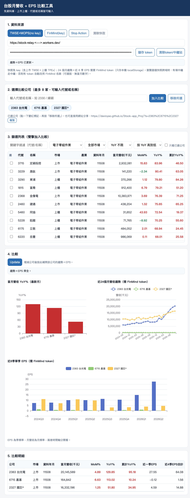

# 台股月營收 + EPS 比較工具

免資料庫的台股基本面小工具：一次比較最多 8 家上市櫃公司的**每月營收**（單月合併）與**每季 EPS**（單季），含 YoY/MoM、三率對照概念的三張比較圖與明細表。所有數字皆來自官方／開放來源的真實資料，無模擬數。

- 🌐 網頁版：https://davioyao.github.io/Stock-app_Proj/ （開啟即用）
- 🖥️ 桌面版：`stock_gui.py`（功能較完整，建議用這個）



## 功能

- 上市＋上櫃當月營收快照（代號、名稱、市場、產業、MoM/YoY/累計 YoY）
- 近 24 個月營收趨勢、近 8 季單季 EPS、當月 YoY 長條圖
- 代號或公司名稱皆可搜尋（名稱自動轉代號）；篩選器（關鍵字／產業／市場／YoY）
- 比較明細含近一季 EPS 與近 4 季 EPS 合計（TTM）

## 網頁版用法

1. 打開上方連結
2. 按 `TWSE+MOPS(no key)` 載入快照（若瀏覽器擋跨域，見下方中繼說明）
3. 在 FinMind 免費註冊拿 token，貼入後按 `FinMind(key)` 補趨勢＋EPS
4. 搜尋加入公司（或從篩選列表雙擊），按 `Updata` 補齊缺口

## 桌面版用法

```bash
conda activate stock_evk        # Python 3.11
cd Stock-app_Proj
pip install -r requirements.txt # 只有 matplotlib
python stock_gui.py
```

按鈕：`TWSE+MOPS(no key)`（免 key 全走官方源）、`FinMind(key)`（快速，需 token）、`Updata`（自動補齊）、`Stop Action`（中斷）。

## 資料來源

| 來源 | 用途 | 備註 |
|---|---|---|
| TWSE / TPEx OpenAPI | 上市＋上櫃當月快照 | 免 key |
| 公開資訊觀測站 MOPS | 24 個月營收、8 季 EPS（累計制轉單季） | 免 key，有短時間流量管制 |
| FinMind API | 同上（原生單月／單季，速度快） | 需免費註冊 token |

## 中繼（給網頁版快照用）

TWSE/TPEx 沒送跨域標頭，瀏覽器會擋。把 `worker.js` 部署到 Cloudflare（ https://www.cloudflare.com/zh-tw/ ），
網址填進頁面「中繼網址」欄即可；FinMind 可直連不需要中繼。桌面版不受影響。

## 檔案

| 檔案 | 說明 |
|---|---|
| `index.html` | 網頁版（單檔，ECharts CDN） |
| `stock_gui.py` | 桌面版（tkinter＋matplotlib） |
| `worker.js` | Cloudflare 中繼範例 |
| `requirements.txt` | 桌面版依賴 |

## 免責聲明

本工具僅供投資研究與程式學習，資料若有延遲或誤差請以公開資訊觀測站公告為準，不構成投資建議。
